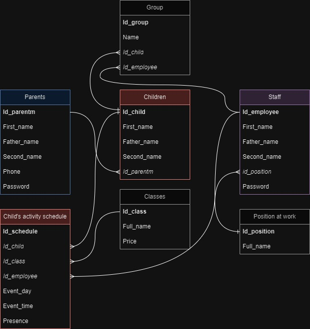
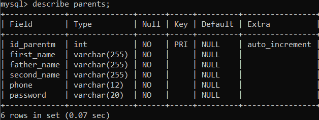
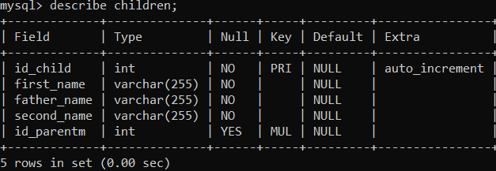
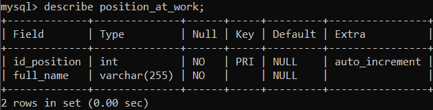
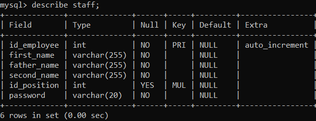
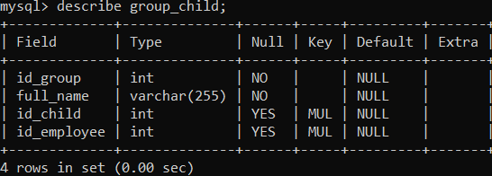
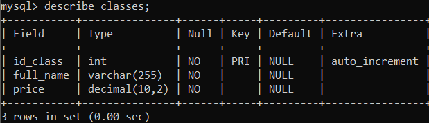
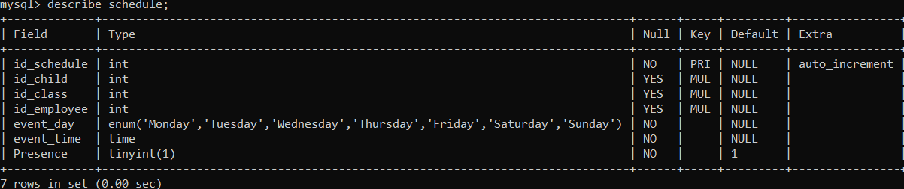

<!--Логотип проекта. Ширина настраивается по усмотрению разработчика-->
<!--Обязательный отступ в одну строку перед заголовком-->

# KINDERGARTEN APP
<!--Название проекта. В данном случае: "ТЕСТОВЫЙ ПРОЕКТ". Заполняется в верхнем регистре-->

<!--Бейджи предоставляющие информацию об основных технологиях проекта: язык программирования, версия .NET (для C#), движок, версия движка, версия проекта в текущей ветке)-->
<!--Например: C#, .NET 6.0, WPF, version 2.0-->
<!--В номере версии указывается только мажорный и минорный номера версии-->

  

## Информация о проекте
<!--Глобальный раздел с информацией о проекте-->

### Описание

&nbsp; Мобильное приложение для отслеживания кружков на которые ходит ребёнок в детском саду.
&nbsp; Создан в рамках курса управление IT-проектами 2023.

<!--Скриншоты храняться вместе с файлами проекта в папке Images, если это не приводит к конфликтам-->

### Дополнительная информация
<h4>Схема базы данных:</h4> 

<h4>Описание таблицы Parents:</h4> 

В данной таблице хранится следующая информация:

1. Id родителя
2. Имя
3. Отчество
4. Фамилия
5. Номер телефона
6. Пароль от учетной записи

<h4>Описание таблицы Children:</h4> 

В данной таблице хранится следующая информация:

1. Id ребенка
2. Имя
3. Отчество
4. Фамилия
5. Id родителя

<h4>Описание таблицы Position_at_work:</h4> 

В данной таблице хранится следующая информация:

1. Id должности
2. Полное наименование должности

<h4>Описание таблицы Staff:</h4> 

В данной таблице хранится следующая информация:

1. Id сотрудник
2. Имя
3. Отчество
4. Фамилия
5. Id должности/должностей
6. Пароль от учетной записи

<h4>Описание таблицы Group_child:</h4> 

В данной таблице хранится следующая информация:

1. Id группы
2. Полное наименование группы
3. Id детей
4. Id воспитятеля

<h4>Описание таблицы Classes:</h4> 

В данной таблице хранится следующая информация:

1. Id кружка
2. Название кружка
3. Стоимость занятий в месяц

<h4>Описание таблицы Schedule:</h4> 

В данной таблице хранится следующая информация:

1. Id расписания
2. Id ребенка
3. Id кружка
4. Id учителя, который ведет данное занятие 
5. День недели, в который проходит занятие
6. Время проведения занятия
7. Посещение кружка (1 - да, 0 - нет)

## Авторы
<!--Последний раздел содержит список авторов проекта, которые как-либо участвовали в его разработке (при наличии аккаунта на GitHub))-->
- [Daria Melekhina](https://github.com/DariaMelekhina)
- [ITHaron](https://github.com/ITHaron)
- [MsGalch](https://github.com/MsGalch)
- [LaxyLax](https://github.com/LaxyLax)
